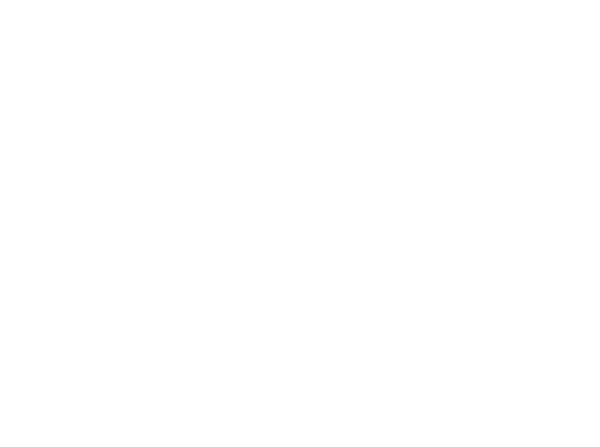
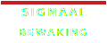
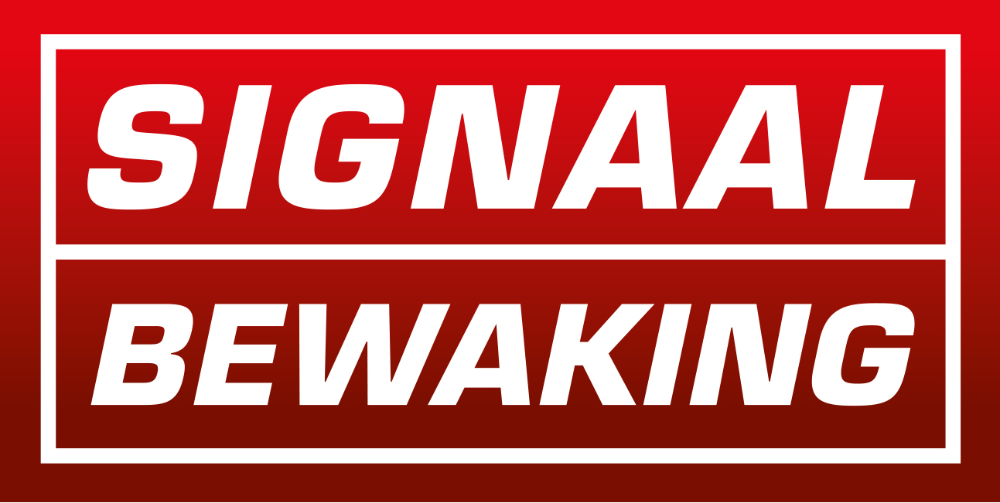
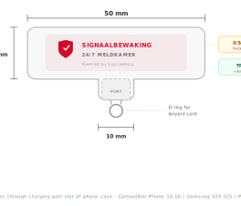
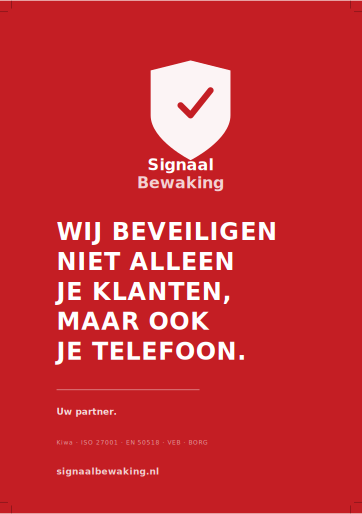
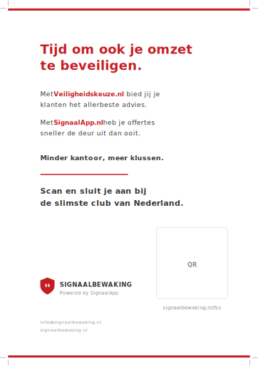
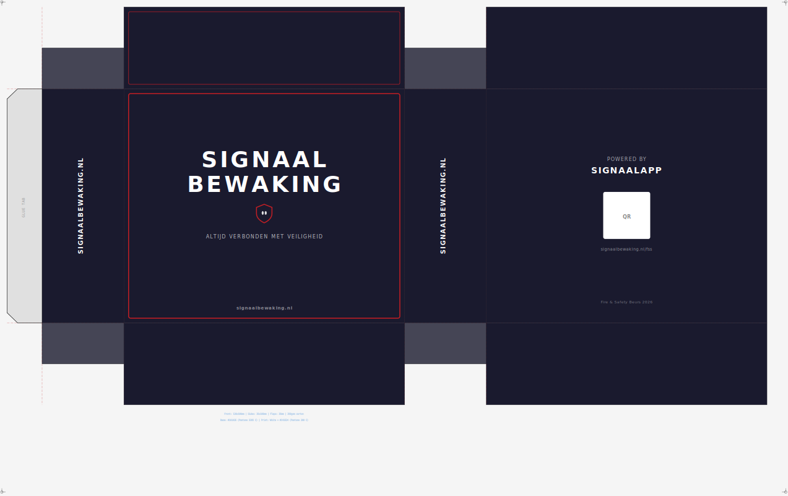
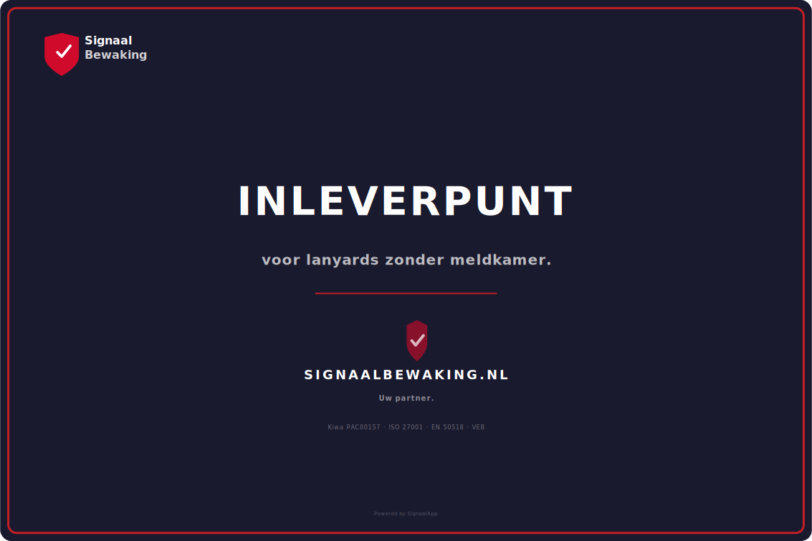

# SignaalBewaking Beurslanyards 2026

**Fire Safety & Security** — Brabanthallen Den Bosch — Stand B.21 — 15 & 16 april 2026

---

## Lanyard Artwork — Logo + Tagline

> *Altijd verbonden met veiligheid.*

Download: [`signaalbewaking-beurslanyards-2026.png`](09_exports/signaalbewaking-beurslanyards-2026.png) — 3600×2689px, wit op transparant

---

## Logo

| Variant | Preview | Bestand |
|---------|---------|---------|
| Standaard |  | [`logo-signaalbewaking.svg`](02_brand/logo-signaalbewaking.svg) |
| White (voor donkere achtergrond) |  | [`logo-signaalbewaking-white.svg`](02_brand/logo-signaalbewaking-white.svg) |
| JPG referentie |  | [`signaalbewaking.jpg`](signaalbewaking.jpg) |
| PNG (wit, transparant) |  | [`logo-signaalbewaking EPS.png`](logo-signaalbewaking%20EPS.png) |

---

## Strap Artwork

| Bestand | Omschrijving | Download |
|---------|-------------|----------|
|  | **Repeat pattern** — 140×25mm, 1 herhaling | [SVG](03_lanyard_artwork/lanyard-strap-repeat.svg) · [PDF](03_lanyard_artwork/lanyard-strap-repeat.pdf) |
|  | **Full length preview** — 10-11 herhalingen | [SVG](03_lanyard_artwork/lanyard-strap-fullength-preview.svg) · [PDF](03_lanyard_artwork/lanyard-strap-fullength-preview.pdf) |

---

## Phone Insert Tab

| Bestand | Omschrijving | Download |
|---------|-------------|----------|
|  | **Insert tab** — 50×15mm, TPU 0.5mm | [SVG](04_insert_tab/phone-insert-tab.svg) · [PDF](04_insert_tab/phone-insert-tab.pdf) |

---

## Marketing Card (90×130mm)

| Bestand | Omschrijving | Download |
|---------|-------------|----------|
|  | **Voorkant** — rood, headline | [SVG](05_badge_card/marketing-card-front.svg) · [PDF](05_badge_card/marketing-card-front.pdf) |
|  | **Achterkant** — wit, QR code | [SVG](05_badge_card/marketing-card-back.svg) · [PDF](05_badge_card/marketing-card-back.pdf) |

---

## Verpakking

| Bestand | Omschrijving | Download |
|---------|-------------|----------|
|  | **Box dieline** | [SVG](06_packaging_box/box-dieline.svg) · [PDF](06_packaging_box/box-dieline.pdf) |
|  | **Recyclebox sticker** | [SVG](06_packaging_box/recyclebox-sticker.svg) · [PDF](06_packaging_box/recyclebox-sticker.pdf) |

---

## Alle exports

Alle bestanden gebundeld in [`09_exports/`](09_exports/) — klaar voor productie.

| Bestand | Formaat |
|---------|---------|
| `signaalbewaking-beurslanyards-2026.png` | PNG 3600×2689 |
| `lanyard-strap-repeat` | SVG + PDF |
| `lanyard-strap-fullength-preview` | SVG + PDF |
| `phone-insert-tab` | SVG + PDF |
| `marketing-card-front` | SVG + PDF |
| `marketing-card-back` | SVG + PDF |
| `box-dieline` | SVG + PDF |
| `recyclebox-sticker` | SVG + PDF |
| `logo-signaalbewaking` | SVG |
| `logo-signaalbewaking-white` | SVG |

---

## Referentiefoto's & Briefing

| Bestand | Omschrijving |
|---------|-------------|
|  | Referentiefoto lanyard set |
|  | Referentiefoto hardware |
| [`design-briefing-signaalbewaking (1).pdf`](beursbestanden/design-briefing-signaalbewaking%20(1).pdf) | Design briefing (PDF) |

---

## Documenten

| Bestand | Omschrijving |
|---------|-------------|
| [`production-spec.md`](01_brief/production-spec.md) | Productiespecificatie |
| [`brand-tokens.md`](02_brand/brand-tokens.md) | Brand tokens |
| [`vendor-report.md`](07_vendor_sourcing/vendor-report.md) | Leveranciers rapport |
| [`quote-request-nl.md`](08_quotes/quote-request-nl.md) | Offerteaanvraag (NL) |
| [`quote-request-en.md`](08_quotes/quote-request-en.md) | Quote request (EN) |
| [`quote-request-zh.md`](08_quotes/quote-request-zh.md) | 报价请求 (ZH) |

---

## Specificaties

- **Strap**: 25mm polyester, full dye-sublimation, dubbelzijdig
- **Kleur**: SignaalBewaking Red #C41E24 / Pantone 200 C
- **Print**: Wit
- **Herhaling**: 140mm
- **Totaal**: 2.500 stuks (1.500 phone + 1.000 badge)
- **Levering**: voor 23 maart 2026

---

**SignaalBewaking** — Schipper Security B.V.
verkoop@signaalbewaking.nl
